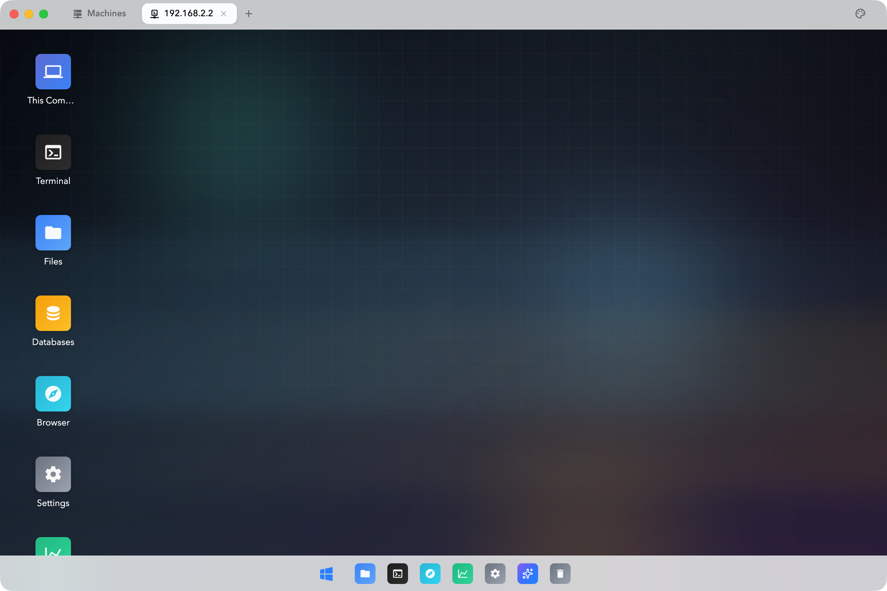
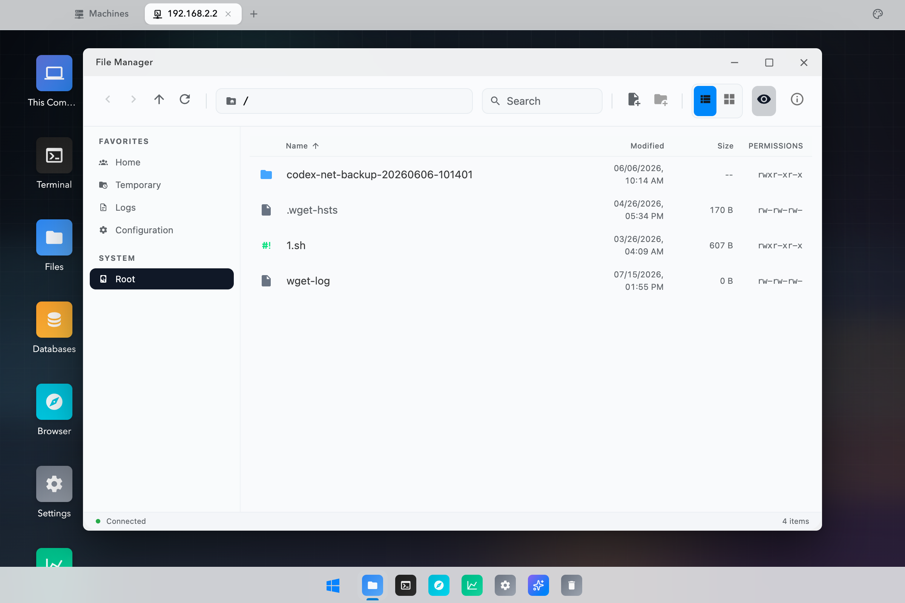
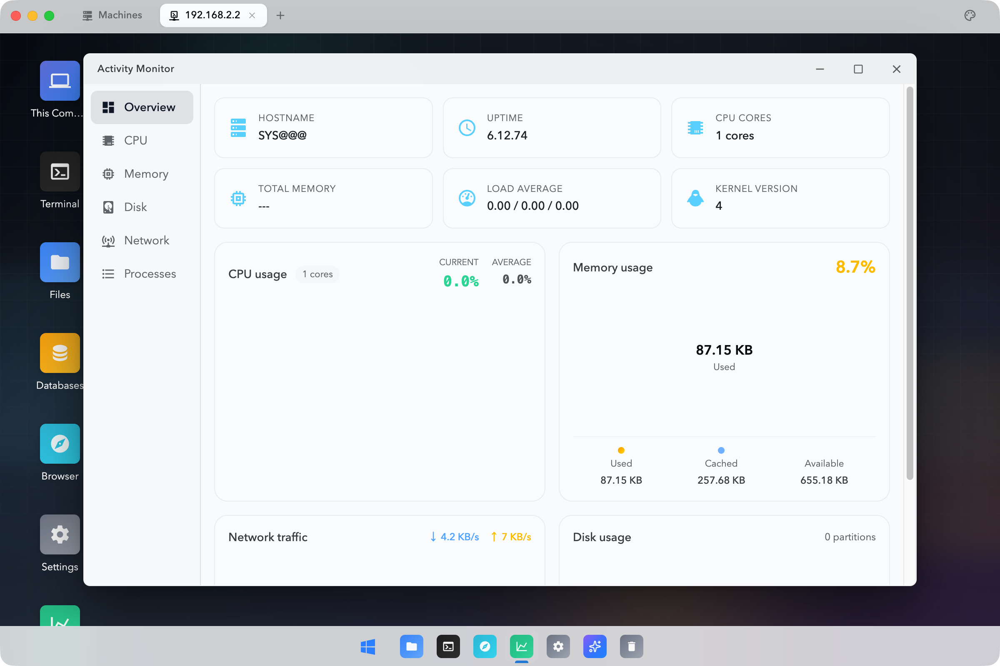
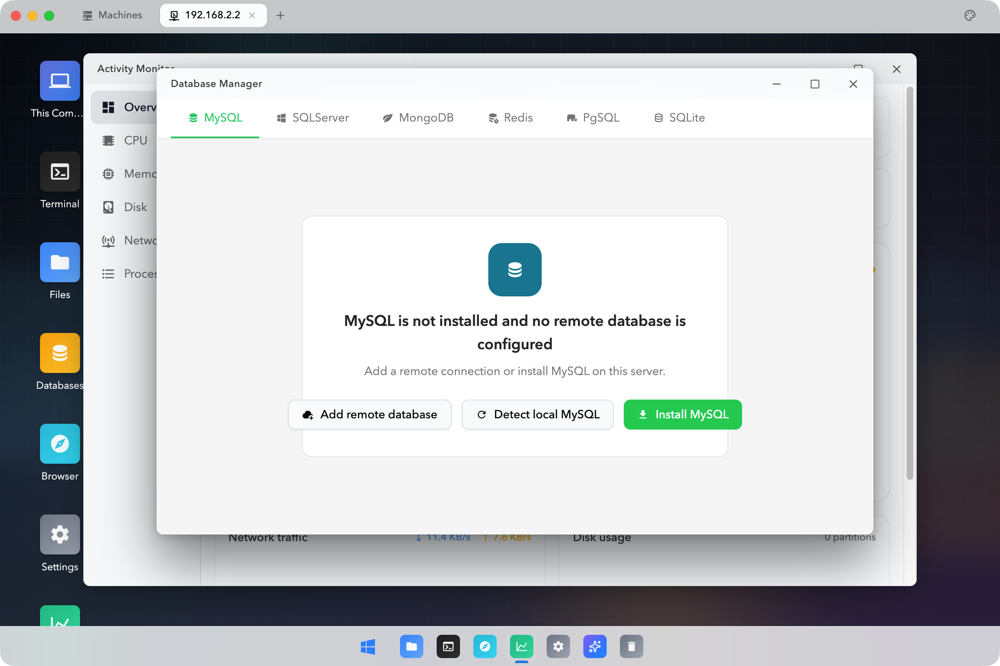
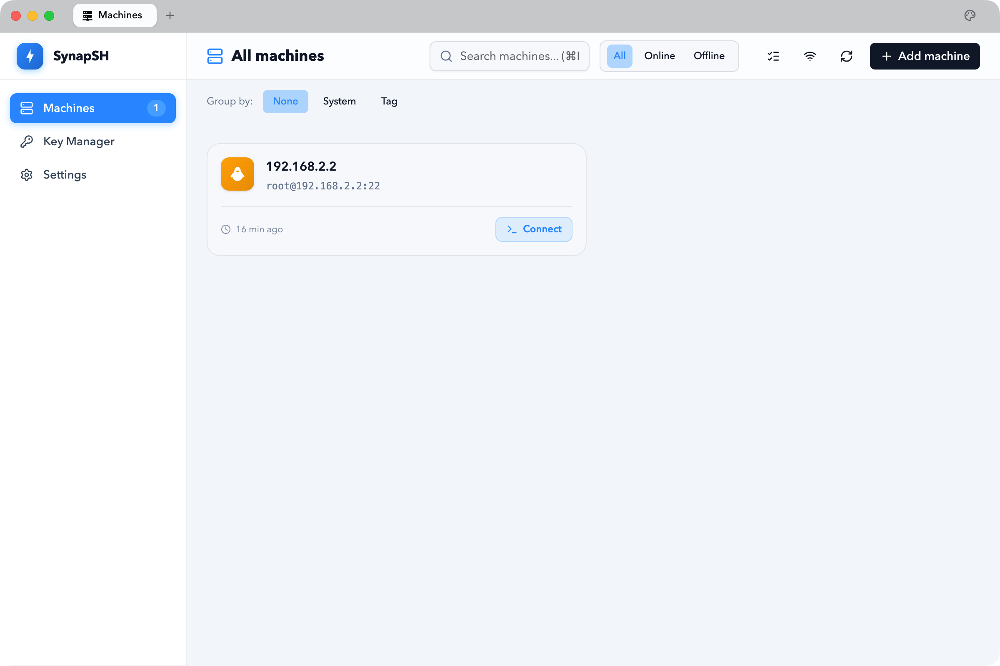

<p align="center">
  <strong>English</strong> | <a href="README.zh-CN.md">简体中文</a>
</p>

<p align="center">
  
</p>

<h1 align="center">SynapSH · 光析</h1>

<p align="center">
  <strong>The Next-Generation Visual Server Management Desktop</strong><br>
  Turn everything in the command line into visible, clickable actions
</p>

<p align="center">
  
  
  
  
  
</p>

---

<p align="center">
  
</p>

<p align="center"><em>The moment you connect to a server, you get more than a terminal—you get an entire desktop.</em></p>

---

## 💡 Why SynapSH?

Traditional SSH tools—whether Xshell, MobaXterm, or iTerm2—are essentially **stacks of terminal emulators**. Managing five servers means juggling five windows and five sets of tabs. File transfers require an SFTP client, monitoring requires `top` or `htop`, and editing configuration means opening `vim`. These fragmented workflows consume a significant amount of an operations engineer's attention.

**SynapSH (光析)** takes a completely different approach:

> 🖥️ Every server becomes a complete graphical desktop.

After connecting, you see a macOS-inspired desktop instead of a blinking cursor. The file manager, terminal, activity monitor, and database manager sit in the Dock like native apps, ready to open with a click. **The command line is still there, but it is no longer your only option.**

## ✨ What Makes It Different

### 🖥️ A True Desktop Experience—a New Paradigm, Not a Simulation

<p align="center">
  
</p>

Traditional SSH clients give you terminal tabs. SynapSH gives you a server desktop.

- **Window management:** Move, resize, maximize, and minimize multiple independent windows
- **One-click Dock launcher:** Open the terminal, file manager, monitor, database manager, or browser instantly
- **Seamless multi-server switching:** Manage every connected server from the top tab bar and leave window overload behind
- **Dark Neo-macOS design:** Enjoy glass materials, refined shadows, and fluid transitions beyond the look of traditional tools

### 📂 Visual File Management—Just Like Working with Local Files

<p align="center">
  
</p>

Leave `ls`, `cd`, and `scp` behind. Built on SFTP, the SynapSH file manager provides a complete graphical workflow:

- **Two view modes:** Switch freely between list and icon views
- **Favorite locations:** Jump directly to home, temporary, log, and configuration directories
- **Complete file details:** See names, modification times, sizes, and permissions at a glance
- **Built-in code editor:** Edit server configuration files directly with Monaco Editor—no more `vim`
- **Breadcrumb path bar:** Navigate clearly with back, forward, and refresh controls

### 📊 Real-Time Performance Monitoring—No More Staring at `top`

<p align="center">
  
</p>

The Activity Monitor is one of SynapSH's signature features, turning raw system metrics into a clear visual dashboard:

- **Overview dashboard:** View the hostname, uptime, CPU core count, kernel version, and load average in one place
- **Real-time CPU monitoring:** Compare current and average usage, with automatic red warnings for unusually high load
- **Memory visualization:** Understand used, cached, and available memory at a glance with a segmented ring chart
- **Disk and network panels:** Track I/O throughput and network traffic in real time
- **Process manager:** Inspect running processes and identify resource-heavy workloads

### 🗄️ Database Management—Six Popular Databases, Ready to Use

<p align="center">
  
</p>

SynapSH includes a database manager for **MySQL · SQL Server · MongoDB · Redis · PostgreSQL · SQLite**:

- **Smart detection:** Automatically discover database instances installed on the server
- **One-click installation:** Install a database directly from the interface when it is missing
- **Remote connections:** Add database connections hosted on other machines
- **Visual operations:** Browse schemas, query data, and edit records through a graphical interface

### 🔐 Secure Connection Management—Easy from the First Click

<p align="center">
  
</p>

- **Simple setup:** Enter the host, username, password or key, and operating system to connect
- **Two authentication modes:** Use password or SSH key authentication
- **Multi-OS support:** Manage Linux, Windows, and macOS servers
- **Groups and filters:** Organize server assets by group, operating system, and tag
- **Online and offline status:** See server connection status in real time
- **Local encrypted storage:** Save connection details locally with better-sqlite3—nothing is uploaded to the cloud

## 🛠️ Tech Stack

| Category | Technology | Description |
|----------|------------|-------------|
| Desktop framework | Electron 33 | Cross-platform desktop application container |
| Frontend framework | Vue 3.6 + TypeScript | Composition API with type safety |
| Build tool | Vite 8 | Fast HMR development experience |
| CSS framework | TailwindCSS v4 | Utility-first styling and theme system |
| UI components | shadcn-vue + Reka UI | Refined headless component library |
| Terminal emulator | xterm.js + WebGL | Smooth GPU-accelerated rendering |
| Code editor | Monaco Editor | The editor engine behind VS Code |
| Data visualization | ECharts 6 | A rich collection of chart types |
| SSH protocol | ssh2 (Node.js) | Native SSH and SFTP implementation |
| Local storage | better-sqlite3 | High-performance local database |
| Icon system | Iconify (mdi / lucide / carbon) | More than 10,000 vector icons |

## 📦 Quick Start

```bash
# Clone the repository
git clone <repo-url>
cd SynapSH

# Install dependencies
pnpm install

# Start development mode
pnpm electron:dev

# Build the production package
pnpm electron:build
```

## 📁 Project Structure

```
src/
├── views/                    # Pages
│   ├── MachineManager.vue    # Machine management and connection list
│   ├── DesktopShell.vue      # Main desktop environment
│   └── apps/                 # Built-in desktop applications
│       ├── TerminalApp.vue        # Terminal
│       ├── FilesApp.vue           # File manager
│       ├── ActivityMonitor.vue    # Activity monitor
│       ├── TextEditorApp.vue      # Text editor
│       ├── DatabaseManagerApp.vue # Database manager
│       └── SettingsApp.vue        # System settings
├── components/               # Reusable components
│   ├── desktop/              # Desktop UI components (windows, Dock, etc.)
│   ├── ConnectionPanel.vue   # Connection panel
│   ├── TabBar.vue            # Tab bar
│   └── ui/                   # shadcn-vue base components
├── composables/              # Composables
├── lib/                      # Utility libraries
└── style.css                 # Global styles

electron/
├── main.ts                   # Main process entry point
├── preload.ts                # Preload script (contextBridge)
└── services/
    ├── ssh.ts                # SSH/SFTP session management
    ├── machine-db.ts         # Local machine database
    └── browser.ts            # Browser proxy
```

## 🎨 Design Principles

| Principle | Description |
|-----------|-------------|
| Dark first | Use a dark theme (`#0b0d10`) by default to reduce eye strain during extended use |
| Neo-macOS style | Combine glass materials (`backdrop-blur`), refined shadows, and fluid transitions |
| Content first | Make every visual effect serve a function and every animation communicate meaning |
| 8-point grid | Keep the interface orderly with consistent spacing (`4/8/12/16/24/32`) and corner radii |
| Semantic colors | Use a clear token system for accent, success, warning, and danger states |

## 🗺️ Roadmap

- [x] 🖥️ macOS-inspired desktop environment
- [x] 💻 SSH terminal connections and multi-tab management
- [x] 📂 Graphical SFTP file management
- [x] 📊 Real-time server performance monitoring
- [x] ✏️ Online code editor powered by Monaco Editor
- [x] 🗄️ Visual management for six database systems
- [x] 🌐 Built-in browser with remote port proxying
- [ ] 🤖 AI operations assistant for natural-language server diagnostics and actions
- [ ] 📡 Multi-server batch operations
- [ ] 🧩 Plugin system

## 📄 License

Private · © 2026 SynapSH Team
