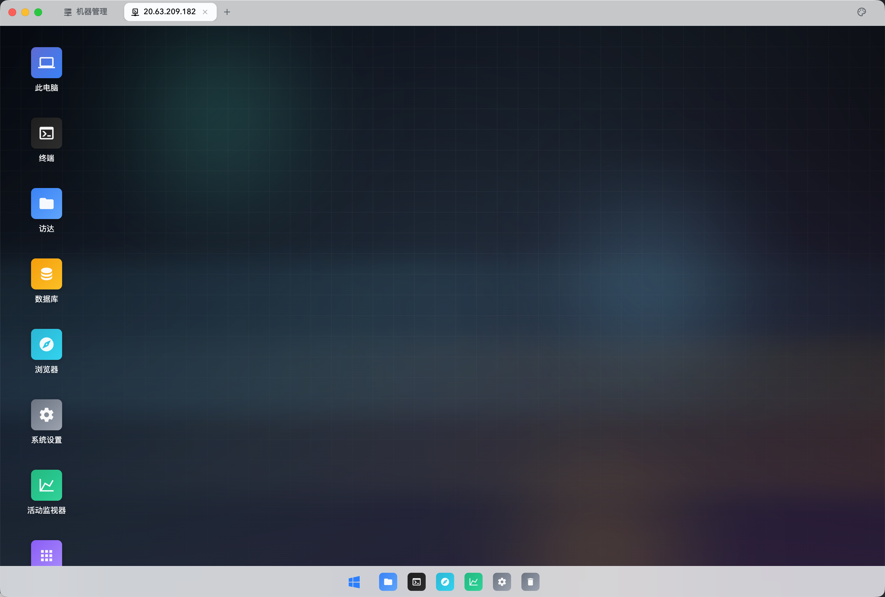
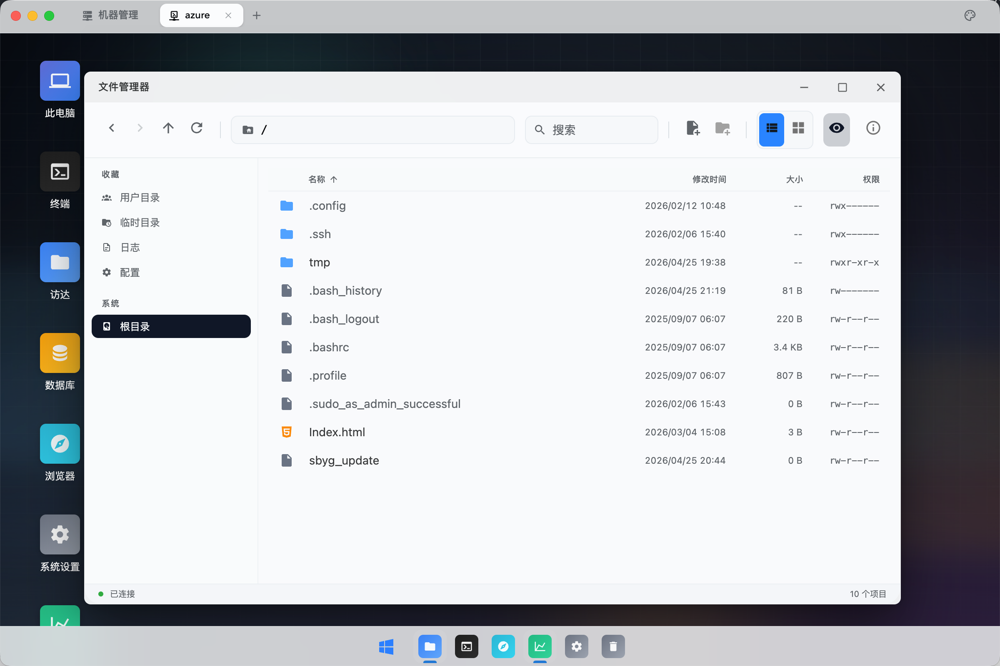
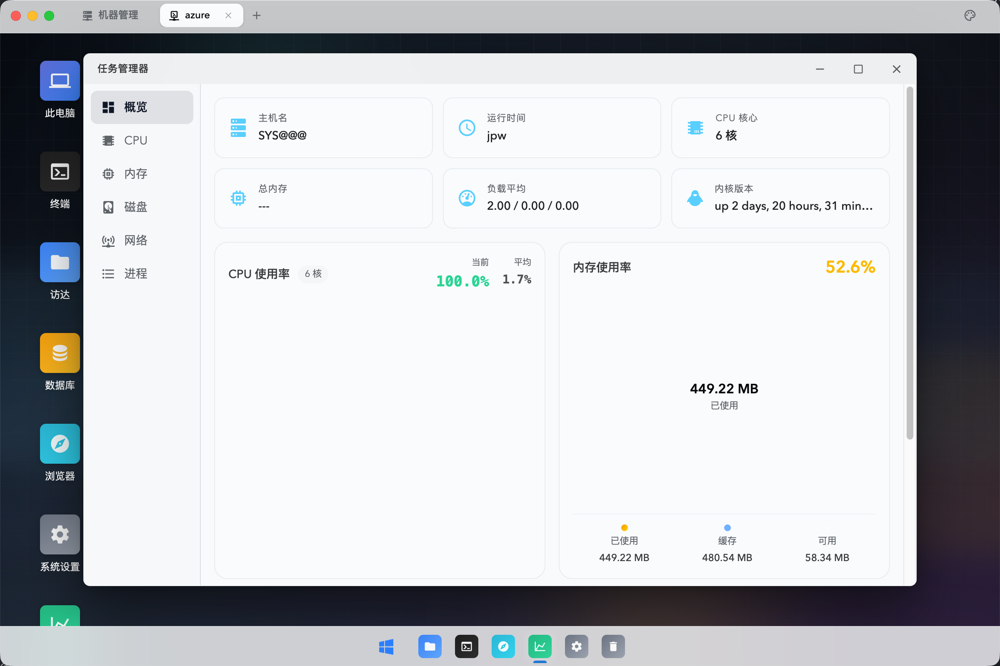
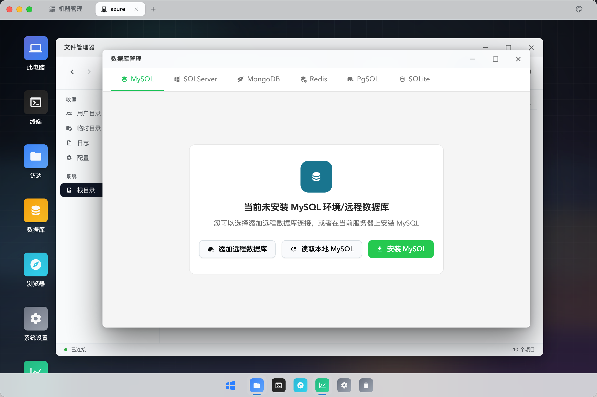
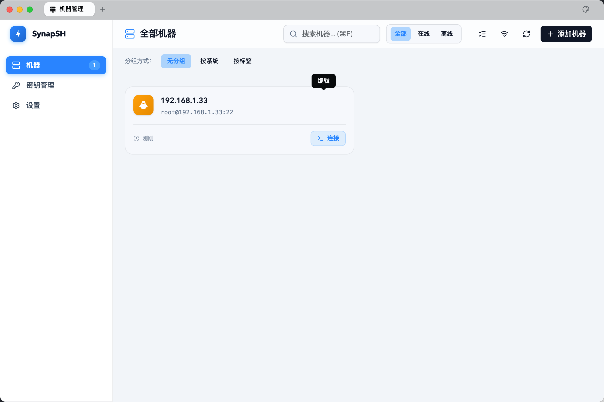

<p align="center">
  <a href="README.md">English</a> | <strong>简体中文</strong>
</p>

<p align="center">
  
</p>

<h1 align="center">SynapSH · 光析</h1>

<p align="center">
  <strong>下一代服务器可视化管理桌面</strong><br>
  把命令行里的一切，变成看得见、点得着的操作
</p>

<p align="center">
  
  
  
  
  
</p>

---

<p align="center">
  
</p>

<p align="center"><em>连上服务器的那一刻，你拥有的不是一个终端，而是一整个桌面。</em></p>

---

## 💡 为什么选择 SynapSH

传统的 SSH 工具——无论是 Xshell、MobaXterm 还是 iTerm2——本质上都是**终端模拟器的堆叠**。你打开 5 台服务器，就得管理 5 个窗口、5 组标签页，在它们之间跳来跳去。文件传输要开 SFTP 客户端，监控要敲 `top`/`htop`，改配置要 `vim`……这些碎片化的工作流，占据了运维工程师大量的心智负担。

**SynapSH（光析）** 用一种完全不同的方式解决这个问题：

> 🖥️ 每一台服务器，都是一个完整的图形化桌面。

连接服务器后，你看到的不是闪烁的光标，而是一个类 macOS 的桌面环境——文件管理器、终端、活动监视器、数据库管理器像原生应用一样排列在 Dock 栏上，随点随开。**命令行依然在，但你不再被迫只用命令行。**

## ✨ 核心差异化

### 🖥️ 真正的桌面级体验——不是模拟，是范式

<p align="center">
  
</p>

传统 SSH 客户端给你的是「终端 Tab」，SynapSH 给你的是「服务器桌面」。

- **窗口管理系统**：拖拽移动、自由缩放、最大化/最小化，多窗口同时运行互不干扰
- **Dock 栏快捷启动**：终端、文件管理器、监控、数据库、浏览器——一键直达
- **多服务器无缝切换**：顶部 Tab 栏管理所有已连接的服务器，告别窗口地狱
- **暗色 Neo-macOS 设计**：毛玻璃材质、精致阴影、流畅过渡动效，视觉体验远超传统工具

### 📂 可视化文件管理——像操作本地文件一样

<p align="center">
  
</p>

忘掉 `ls`、`cd`、`scp` 的日子。SynapSH 的文件管理器基于 SFTP 协议构建，提供完整的图形化文件操作：

- **双视图模式**：列表视图 / 图标视图自由切换
- **收藏夹导航**：用户目录、临时目录、日志、配置文件夹一键跳转
- **完整的文件信息**：文件名、修改时间、大小、权限一目了然
- **内置代码编辑器**：基于 Monaco Editor，直接在线编辑服务器上的配置文件，不用再 `vim` 了
- **面包屑路径栏**：清晰的路径层级，前进/后退/刷新导航

### 📊 实时性能监控——告别盯着 `top` 刷数字

<p align="center">
  
</p>

活动监视器是 SynapSH 的杀手级功能之一，把枯燥的系统指标变成直观的可视化面板：

- **概览仪表盘**：主机名、运行时间、CPU 核心数、内核版本、负载平均值一屏呈现
- **CPU 实时监控**：当前/平均使用率双指标，异常高负载自动高亮（红色警告）
- **内存可视化**：已使用/缓存/可用三段式展示，用环形图一眼看清内存分布
- **磁盘 & 网络面板**：I/O 吞吐、网络流量实时图表
- **进程管理器**：查看所有运行进程，定位资源占用大户

### 🗄️ 数据库管理——六大主流数据库开箱即用

<p align="center">
  
</p>

SynapSH 内置数据库管理器，覆盖 **MySQL · SQL Server · MongoDB · Redis · PostgreSQL · SQLite** 六大主流数据库：

- **智能检测**：自动检测服务器上已安装的数据库实例
- **一键安装**：如果服务器上没有安装，可以直接在界面上点击安装
- **远程连接**：支持添加非本机的远程数据库连接
- **可视化操作**：图形化的表结构浏览、数据查询与编辑

### 🔐 安全连接管理——零门槛上手

<p align="center">
  
</p>

- **极简添加流程**：填写主机地址、用户名、密码/密钥，选择操作系统类型即可连接
- **双认证模式**：支持密码认证和 SSH 密钥认证
- **多操作系统支持**：Linux / Windows / macOS 服务器均可管理
- **分组与筛选**：按组、按系统类型、按标签多维度管理服务器资产
- **在线/离线状态**：实时显示服务器连接状态
- **本地加密存储**：连接信息使用 better-sqlite3 本地加密保存，不上传云端

## 🛠️ 技术栈

| 类别 | 技术 | 说明 |
|------|------|------|
| 桌面框架 | Electron 33 | 跨平台桌面应用容器 |
| 前端框架 | Vue 3.6 + TypeScript | 组合式 API + 类型安全 |
| 构建工具 | Vite 8 | 极速 HMR 开发体验 |
| CSS 框架 | TailwindCSS v4 | 原子化样式 + 主题系统 |
| UI 组件 | shadcn-vue + Reka UI | 精致的无头组件库 |
| 终端模拟 | xterm.js + WebGL | GPU 加速渲染，丝滑流畅 |
| 代码编辑 | Monaco Editor | VS Code 同款编辑器内核 |
| 数据可视化 | ECharts 6 | 丰富的图表类型 |
| SSH 协议 | ssh2 (Node.js) | 原生 SSH/SFTP 协议实现 |
| 本地存储 | better-sqlite3 | 高性能本地数据库 |
| 图标系统 | Iconify (mdi / lucide / carbon) | 10,000+ 矢量图标 |

## 📦 快速开始

```bash
# 克隆项目
git clone <repo-url>
cd SynapSH

# 安装依赖
pnpm install

# 启动开发模式
pnpm electron:dev

# 构建生产包
pnpm electron:build
```

## 📁 项目结构

```
src/
├── views/                    # 页面
│   ├── MachineManager.vue    # 机器管理（连接列表）
│   ├── DesktopShell.vue      # 桌面环境主界面
│   └── apps/                 # 桌面内置应用
│       ├── TerminalApp.vue        # 终端
│       ├── FilesApp.vue           # 文件管理器
│       ├── ActivityMonitor.vue    # 活动监视器
│       ├── TextEditorApp.vue      # 文本编辑器
│       ├── DatabaseManagerApp.vue # 数据库管理
│       └── SettingsApp.vue        # 系统设置
├── components/               # 可复用组件
│   ├── desktop/              # 桌面 UI 组件（窗口、Dock 等）
│   ├── ConnectionPanel.vue   # 连接面板
│   ├── TabBar.vue            # 标签栏
│   └── ui/                   # shadcn-vue 基础组件
├── composables/              # 组合式函数
├── lib/                      # 工具库
└── style.css                 # 全局样式

electron/
├── main.ts                   # 主进程入口
├── preload.ts                # 预加载脚本（contextBridge）
└── services/
    ├── ssh.ts                # SSH/SFTP 会话管理
    ├── machine-db.ts         # 本地机器数据库
    └── browser.ts            # 浏览器代理
```

## 🎨 设计理念

| 原则 | 描述 |
|------|------|
| 暗色优先 | 默认深色主题 (`#0b0d10`)，减少长时间使用的视觉疲劳 |
| Neo-macOS 风格 | 毛玻璃材质 (`backdrop-blur`)、精致阴影、流畅过渡动效 |
| 内容优先 | 视觉效果服务于功能，每个动画都传达语义，不做无意义的装饰 |
| 8pt 栅格系统 | 统一的间距 (`4/8/12/16/24/32`) 与圆角规范，界面整洁有序 |
| 语义化色彩 | 色彩 Token 系统：accent / success / warning / danger 语义清晰 |

## 🗺️ Roadmap

- [x] 🖥️ 类 macOS 桌面环境
- [x] 💻 SSH 终端连接与多 Tab 管理
- [x] 📂 图形化 SFTP 文件管理
- [x] 📊 实时服务器性能监控
- [x] ✏️ 在线代码编辑器（Monaco Editor）
- [x] 🗄️ 六大数据库可视化管理
- [x] 🌐 内置浏览器（远程端口代理）
- [ ] 🤖 AI 智能运维助手（自然语言驱动的服务器诊断与操作）
- [ ] 📡 多服务器批量操作
- [ ] 🧩 插件系统

## 📄 License

Private · © 2026 SynapSH Team
